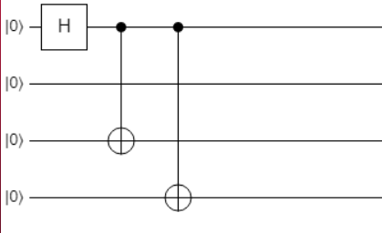
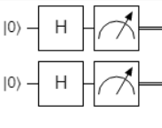

# Домашнее задание 3

### Шевцов А-13а-19

## **2. Машины Тьюринга**  
Результаты работы в файлах YAML, как требуется - формат такой же, как даёт экспорт [turingmachine.io](https://turingmachine.io/).

**2.1 Операции с числами**  
Реализуйте машины Тьюринга, которые позволяют выполнять следующие операции:  
1. Сложение двух унарных чисел (1 балла)  
   [YAML](./1_1.yaml)  
2. Умножение унарных чисел (1 балл)  
   [YAML](./1_2.yaml)  

**2.2 Операции с языками и символами**  
Реализуйте машины Тьюринга, которые позволяют выполнять следующие операции:  
1. Принадлежность к языку $L = \{0^n1^n2^n\}, n \ge 0$ (0.5 балла)  
   *`примечание: ответ на ленте 0 или 1`*  
   [YAML](./2_1.yaml)  
2. Проверка соблюдения правильности скобок в строке (минимум 3 вида скобок) (0.5 балла)  
   *`примечание: ответ на ленте 0 или 1`*  
   [YAML](./2_2.yaml)  
3. Поиск минимального по длине слова в строке (слова состоят из символов 1 и 0 и разделены
пробелом) (1 балл)  
   [YAML](./2_3.yaml)  

## **3 Квантовые вычисления**

В качестве решения задачи надо предоставить схему алгоритма для частного случая при фиксированном количестве кубитов и фиксированных состояниях.

**3.1 Генерация суперпозиций 1 (1 балл)**  
Дано N кубитов $(1 \le N \le 8)$ в нулевом состоянии $|0...0 \rangle$. Также дана некоторая последовательность битов, которое задаёт ненулевое базисное состояние размера $N$. Задача получить
суперпозицию нулевого состояния и заданного.
$$|Si\rangle = \frac{1}{\sqrt{2}}(|0...0 \rangle) + |\psi\rangle)$$
То есть требуется реализовать операцию, которая принимает на вход:
То есть требуется реализовать операцию, которая принимает на вход:
1. Массив кубитов $qs$
2. Массив битов $bits$ описывающих некоторое состояние $|\psi\rangle$. Это массив имеет тот же самый
размер, что и $qs$. Первый элемент этого массива равен 1.  

**Решение:**  
Частный случай N = 4:  
$$|Si\rangle = \frac{1}{\sqrt{2}}(|0000 \rangle) + |1011\rangle)$$  
  
Код:
```
namespace Solution{
   open Microsoft.Quantum.Canon;
   open Microsoft.Quantum.Intrinsic;
   operation Solve (qs : Qubit[], bits : Bool[]) : Unit
   {
      H(qs[0]);
      for i in 1 .. Length(qs)-1{
         if(bits[i]){
               CNOT(qs[0], qs[i]);
         }
      }
   }
}
```
**3.2 Различение состояний 1 (1 балл)**  
Дано $N$ кубитов $(1 \le N \le 8)$, которые могут быть в одном из двух состояний:  
$$|GHZ\rangle = \frac{1}{\sqrt{2}}(|0...0\rangle + |1...1\rangle )$$
$$|W\rangle = \frac{1}{\sqrt{N}}(|10...0\rangle + |01...0\rangle + |00...1\rangle)$$
Требуется выполнить необходимые преобразования, чтобы точно различить эти два состояния. Возвращать 0, если первое состояние и 1, если второе.  

**Решение:**  
Частный случай N = 4:  
$$|GHZ\rangle = \frac{1}{\sqrt{2}}(|0000\rangle + |1111\rangle )$$
$$|W\rangle = \frac{1}{\sqrt{4}}(|1000\rangle + |0100\rangle + |0010\rangle + |0001\rangle)$$
Эти два состояния абсолютно различны и для их различения надо их просто измерить их. Во втором один из кубитов будет всегда давать одну единицу, в то время, как первый - или все или 0.

Заметим, что для $N = 1$ мы не можем их различить точно:  
$$|GHZ\rangle = \frac{1}{\sqrt{2}}(|0\rangle + |1\rangle ) = |+\rangle$$
$$|W\rangle = |1\rangle$$

Код:
```
namespace Solution{
   open Microsoft.Quantum.Canon;
   open Microsoft.Quantum.Intrinsic;
   operation Solve (qs : Qubit[]) : Int
   {
         mutable countOnes = 0;
         for i in 0..Length(qs)-1 {
         if (M(qs[i]) == One) {
                  set countOnes += 1;
            }
         }
         if (countOnes == 0 or countOnes == Length(qs)) {
            return 0;
         }
         return 1; 
   }
}
```

**3.3 Различение состояний 2 (2 балла)**  
Дано 2 кубита, которые могут быть в одном из двух состояний:  
$$|S_0\rangle = \frac{1}{2}(|00 \rangle + |01\rangle+ |10\rangle+ |11\rangle)$$  
$$|S_1\rangle = \frac{1}{2}(|00 \rangle - |01\rangle+ |10\rangle- |11\rangle)$$  
$$|S_2\rangle = \frac{1}{2}(|00 \rangle + |01\rangle- |10\rangle- |11\rangle)$$  
$$|S_3\rangle = \frac{1}{2}(|00 \rangle - |01\rangle- |10\rangle+ |11\rangle)$$  
Требуется выполнить необходимые преобразования, чтобы точно различить эти четыре состояния. Возвращать требуется индекс состояния (от 0 до 3).  

**Решение:**  
тк мы не можем просто различить эти состояния, то применим преобразование:
для каждого кубита оператор $H$ => их комбинация $U = H \otimes H = \begin{pmatrix} 1H & 1H\\ 1H & -1H\end{pmatrix} =  \begin{pmatrix} 1& 1& 1& 1\\ 1& -1& 1& -1\\ 1& 1& -1& -1\\ 1& -1& -1& 1\\ \end{pmatrix}$  
  
  
  
Таким образом, $US_j = \Ket{j_{2}}, j = 0..3$ => мы имеем 4 легко различимых вектора.  
Код:
```
namespace Solution{
    open Microsoft.Quantum.Canon;
    open Microsoft.Quantum.Intrinsic;
    operation Solve (qs : Qubit[]) : Int
    {
        H(qs[0]);
        H(qs[1]);
        let a = M(qs[0]);
        let b = M(qs[1]);
        let result = (a == One ? (b == One ? 3 | 2) | (b == One ? 1 | 0));
        return result;
    }
}
```